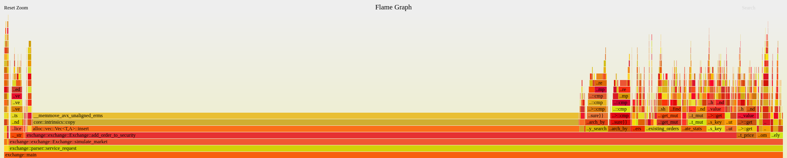

# RustX
A simple text based stock exchange written in Rust

## Setup
Clone the repository, make sure you have Cargo installed. To build and execute the program, type `cargo run`.

## Usage
The instructions will appear when the program starts running, but briefly, there are 3 types of **Requests**: *Order* requests, *Information* requests, and a *Simulation* request.

- **Order requests**: These consist of *buy* and *sell* orders, and have the form `action symbol quantity price`, where symbol is the stock ticker (like `TSLA` for tesla).
- **Info requests**: These consist of basic information requests and have the following format: `action symbol`. The following info requests are currently supported,
  - *Price* request, which returns the latest price at which a trade occured, or helpful messages that informs the user that the market either doesn't exist, or that no trades have occured yet.
  - *Current market view* request, which shows the current buy and sell orders in the market as tables.
  - *History* requests, which shows all the past trades that were filled in the market.
- **Simulation request**: This request lets you simulate random market activity.
  - Format:`simulate symbol num_trades`.
  - There is a 50% chance of buying, 50% chance of selling. The price of each order deviates +/- 5% from the last traded price, and the number of shares is randomly chosen from a short range.

## Technical Details
<strike>Basically no effort has gone to performance, but I measured about 1.5 min for 1 million orders (no print statements). I suspect most of the runtime is spent moving elements in the buy/sell vectors, and that using BSTs here would result in far better performance (we insert/remove the front of a large vector *very frequently*).</strike>

By sorting the sell orders in descending order, we can pop the lowest offer off the back of the vector instead removing from the front. This brought the runtime down to ~23 sec for 1 million orders. We still move a lot of data when inserting in a way that maintains order, so there are still gains up for grabs if we use a data structure that has better insertion runtime guarantees.

Below is a flamegraph showing the time spent in each function call (kind of like a graphical version of GProf and Perf). Clearly, a large portion (~60%) of the execution time is spent in `Vec::insert`, so if I do any more work on this, it will be modifying the data structure that market orders are stored in.

## Demo
In this demo, 3 `buy` orders are placed and subsequently sorted by price, then 4 `sell` orders are placed. Some of these `sell` orders consume existing buy orders and then disappear, others consume buy orders and then remain on the market.

